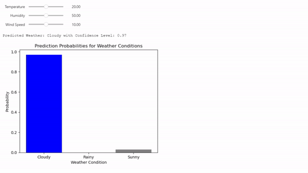

# model-and-simulation-weather-prediction
This project focuses on the application of Python for modeling and simulation tasks, with a main
emphasis on gaining practical experience with popular Python libraries and tools. The overall goal is to
learn how to use these tools effectively in the stages of data creation, exploratory data analysis (EDA),
model building, and interactive forecasting. By leveraging Python's flexible features, the project seeks to
offer a thorough understanding of the modeling and simulation methods, enhancing practical abilities
and knowledge in the field of data-driven forecasts. The project consists of creating synthetic weather
data, examining it through exploratory data visualization, designing and training a weather forecasting
model, and developing an interactive forecasting component, all using Python and well-known libraries
such as NumPy, Pandas, Scikit-learn, Matplotlib, Seaborn, and Jupyter widgets. This hands-on strategy
ensures a comprehensive and applied grasp of modeling and simulation techniques within the Python
environment.
# Sample Run

